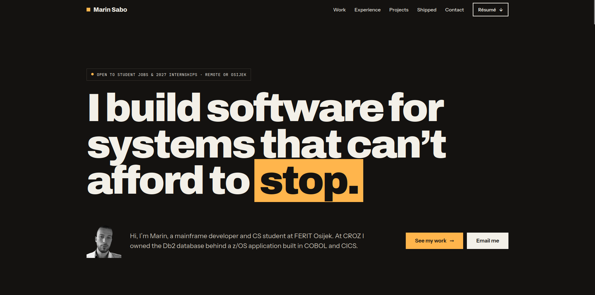
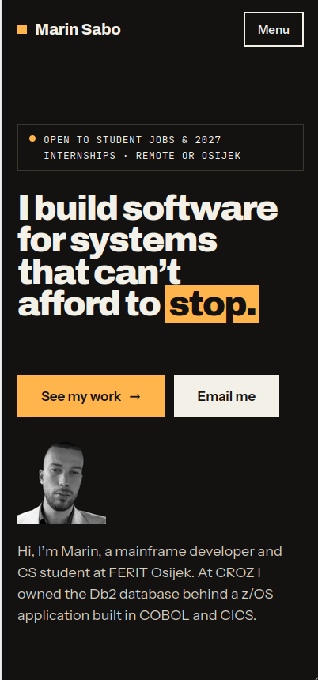

<h1 align="center">Portfolio Website</h1>

A website showcasing my skills, projects, and some basic information about me.

## Links

- [Repo](https://github.com/marinsabo/Portfolio-Website "Portfolio-Website Repo")
- [Live](https://marinsabo.online "Live View")

## Screenshots

## Built With

- HTML5
- CSS3
- JavaScript

## AI Usage

Generative AI was used in this project in the following ways:

- analyzing a large number of existing portfolio websites to identify common patterns and best practices
- brainstorming which sections and information recruiters and employers find most useful
- writing small code snippets, which I reviewed, tested, and adapted before including them
